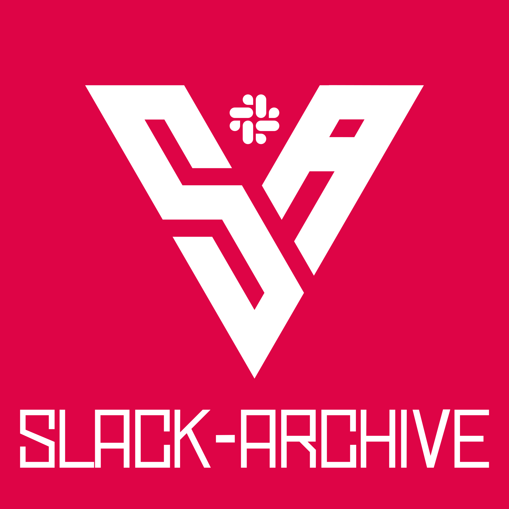

# Export your Slack workspace as static HTML

Alright, so you want to export all your messages on Slack. You want them in a format that you
can still enjoy in 20 years. This tool will help you do that.

 * **Completely static**: The generated files are pure HTML and will still work in 50 years.
 * **Everything you care about**: This tool downloads messages, files, and avatars.
 * **Nothing you do not care about**: Choose exactly which channels and DMs to download.
 * **All types of conversations**: We'll fetch public channels, private channels, DMs, and multi-person DMs.
 * **Incremental backups**: If you already have local data, we'll extend it - no need to download existing stuff again.
 * **JSON included**: All data is also stored as JSON, so you can consume it with other tools later.
 * **No cloud, free**: Do all of this for free, without giving anyone your information.


## Using it

1. Make sure you have [Node.js](https://nodejs.org/en/) installed, ideally something newer than Node v14.
2. Download and run a _temporary_ installation of the package, through the mighty `npx`[^1] runner:

   ```sh
   npx slack-archive
   ```
3. Feed your [User OAuth Token](#getting-a-token) to the prompt and let the program interactively guide you through all the options.
4. The exported data will be stored, in nice HTML format, inside the `./slack-archive` subdirectory. If the subdirectory already exist the program will compare the available workspace data with its content and download and merge only the newer additions.

Alternatively, to run a development version in Docker:
1. Checkout the code from Git
2. Make sure Docker is installed
3. Run `./run_in_docker.sh`

This will build Docker image called `slack-archive:dev`, compile it and start the interactive guide.
Results wil be saved in folder `slack-archive_USERDATA/`.

### Parameters

```
--automatic:                Don't prompt and automatically fetch all messages from all channels.
--use-previous-channel-config: Fetch messages from channels selected in previous run instead of prompting.
--channel-types             Comma-separated list of channel types to fetch messages from.
                            (public_channel, private_channel, mpim, im)
--exclude-channels          Comma-separated list of channels to exclude, in automatic mode
--no-backup:                Don't create backups. Not recommended.
--no-search:                Don't create a search file, saving disk space.
--no-file-download:         Don't download files.
--no-slack-connect:         Don't connect to Slack, just generate HTML from local data.
--force-html-generation:    Force regeneration of HTML files. Useful after slack-archive upgrades.
```

## Getting a token

In order to download messages from private channels and direct messages, we will need a "User OAuth Token" associated with you and the target workspace. Slack uses this token to identify what permissions it'll give this app. We used to be able to just copy a token out of your Slack app, but now we'll need to create a custom app, install it to the target workspace and retrieve the token from its Slack API tab.

This will be mostly painless, I promise.

### 1) Configure your custom app

- Head over to https://api.slack.com/apps and sign in to your account.
- Press the `Create New App` button and select the `From an app manifest` option.
- Choose the workspace you'd like to backup with slack-archive.
- When prompted for an App Manifest, just paste in the following yaml configuration:

```yaml
_metadata:
  major_version: 1
  minor_version: 1
display_information:
  name: "Slack-Archive_<username>"
  description: "Export user-visible channel data as static HTML. Incrementally."
  background_color: "#de0446"
features:
  bot_user:
    display_name: Slack-Archive
    always_online: false
oauth_config:
  scopes:
    user:
      - channels:read
      - channels:history
      - files:read
      - groups:read
      - groups:history
      - mpim:read
      - mpim:history
      - im:read
      - im:history
      - users:read
    bot:
      - commands
      - chat:write
      - chat:write.public
settings:
  org_deploy_enabled: false
  socket_mode_enabled: false
  token_rotation_enabled: false
```

- Replace `<username>` with whatever identifier you prefer (e.g. `your-surname`); please notice that this app-name will be visible to all the workspace members, in the `Apps` tab of the Slack UI.
- Proceed and confirm the summary: your custom app is ready!
 

### 2) Authorize

Make sure you have your Slack workspace `URL` (aka team name) and your app's `client id`.
Then, in a browser, open this URL - replacing `{your-team-name}` and `{your-client-id}`
with your values.

```
https://{your-team-name}.slack.com/oauth/authorize?client_id={your-client-id}&scope=client
```

Confirm everything until Slack sends you to the mentioned non-existent URL. Look at your
browser's address bar - it should contain an URL that looks like this:

```
https://notarealurl.com/?code={code}&state=
```

Copy everything between `?code=` and `&state`. This is your `code`. We'll need it in the
next step.

Next, we'll exchange your code for a token. To do so, we'll also need your `client secret` 
from the first step when we created your app. In a browser, open this URL - replacing 
`{your-team-name}`, `{your-client-id}`, `{your-code}` and `{your-client-secret}` with 
your values.

```
https://{your-team-name}.slack.com/api/oauth.access?client_id={your-client-id}&client_secret={your-client-secret}&code={your-code}
```

Your browser should now be returning some JSON including a token. Make a note of it - that's what we'll use. Paste it in the command line, OR create a file called `.token` in the slack-archive directory (created when the command is first run) and paste it in there.
